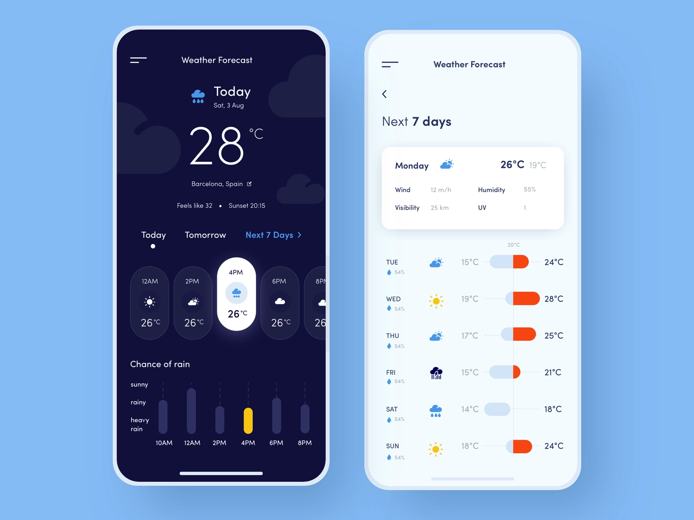

# Bennu Weather App

Design and implement a functional weather web application that precisely aligns with the attached user interface specifications.

**Design**

- The app is **NOT** responsive and it must match the iPhone X UI design above.
  _(Dimensions: 1125px x 2436px (375pt x 812pt @3x))._
- The app only supports portrait mode.
- Use Google the following [google font](https://fonts.google.com/specimen/Poiret+One)
- Use this [color theme](https://aco-viewer.appspot.com/7f9aa74b162cd526c376665961e4bc29) or a color picker for the missing colors
- Use [Weather icons](https://erikflowers.github.io/weather-icons/)
- Use [Bootstrap Icons](https://erikflowers.github.io/weather-icons/) for all other icons

**Functionality**

- The app menu is not functional but it must be represented in the UI.
- When the app starts it displays the user's location current weather.
- The Dark Mode functionality is configured to automatically adjust based on the user's local sunset and sunrise times.
- Today's and Tomorrow's weather are visible on the same page.
- Next 7 days weather is visible on another page.

**Technical**

- Build the app using Angular. If you want to use another UI framework, please contact us for an authorization.
- Use [Tomorrow.io](https://docs.tomorrow.io/reference/welcome) developer api to obtain the weather data

**Submissions**

- Your submission will initially be assessed by a non-technical reviewer. To facilitate this process, please include a comprehensible README file that outlines the necessary steps to run your application.

- Please upload your solution to your personal Git account and forward the repository URL to careers@bennu.tech. Kindly ensure that your Curriculum Vitae (CV) is included in the email.

Every question is important, so please do not hesitate to inquire. We will swiftly respond to all queries sent to our email, `careers@bennu.tech`, using the subject line `Bennu Weather App Question`.
